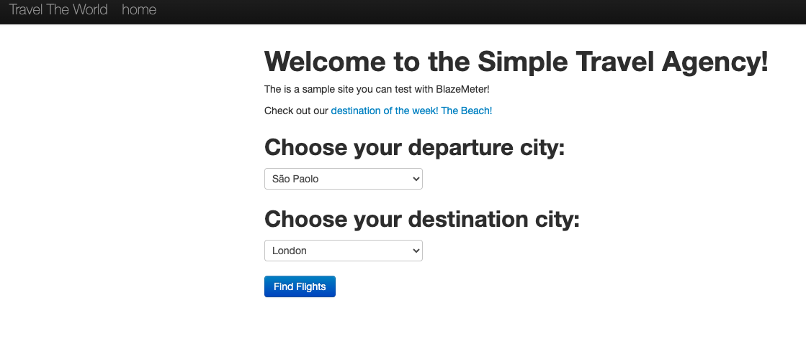
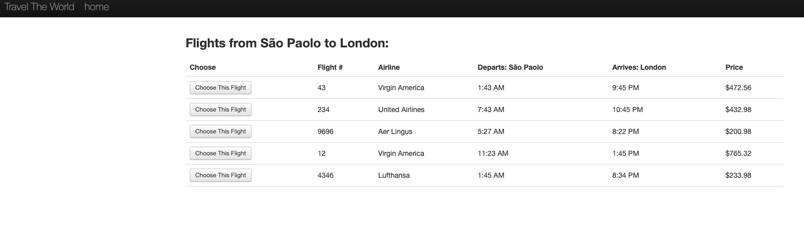

# Teste Exploratório - BlazeDemo

Este projeto apresenta a execução de **testes exploratórios** no site BlazeDemo 

## Objetivo
Avaliar o fluxo de compra, validações e experiência do usuário.

## Tipo de teste
- Exploratório funcional

## Principais achados
- Ausência de validações no formulário
- Aceitação de dados inválidos
- Login valida apenas formato do e-mail, mas retorna erro 419 ao tentar autenticar

## Evidências
**Login**  

**Tela inicial / Travel the World**  

**Lista de voos**  

**Formulário com dados inválidos**  

**Confirmação de compra**  

