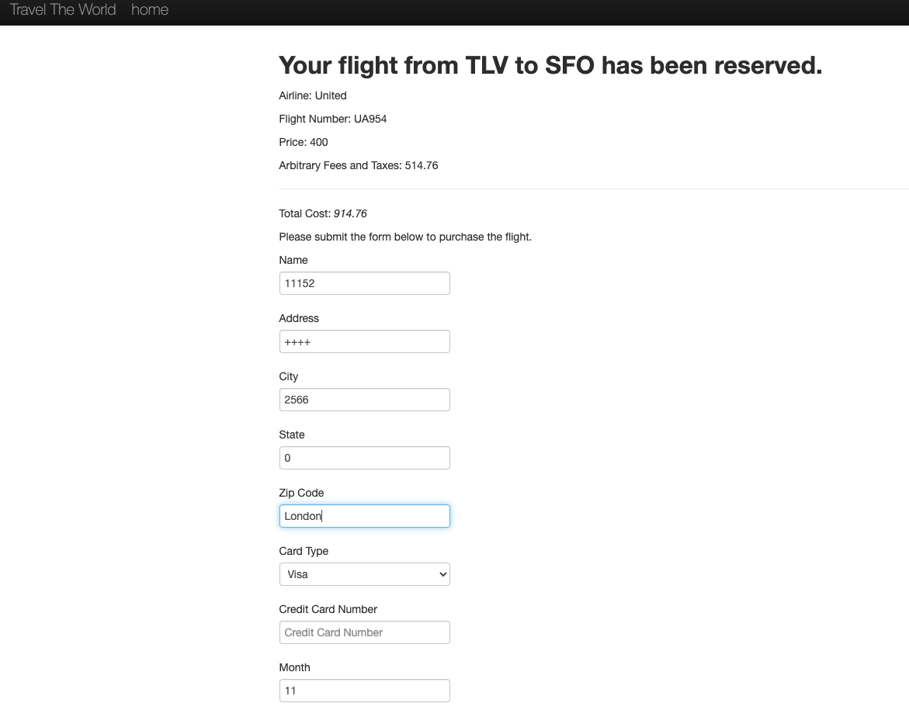

Title: Ausência de validação nos campos do formulário

Steps to reproduce:
1. Acessar o fluxo de compra
2. Inserir valores inválidos nos campos (ex: símbolos, números em nome)
3. Submeter o formulário

Expected result:
Campos devem possuir validações (ex: nome apenas letras, cartão numérico).

Actual result:
Todos os campos aceitam qualquer tipo de entrada sem validação.

Severity: High
Priority: High

Evidence:
